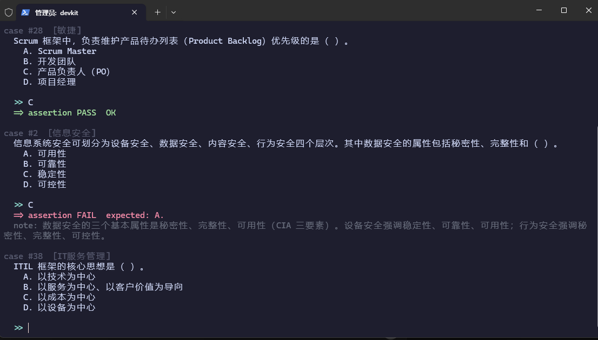

# ruankao-test-runner

终端刷题器，低调模式 —— 外观像在跑单元测试 / 看构建日志，实际上在刷软考**信息系统项目管理师（高项）**题。

- **键盘 CLI**：零依赖，仅用 Python 3 标准库，不联网、无弹窗、纯键盘。
- **终端鼠标 TUI**（默认在终端内启用）：在命令行里**用鼠标点选项作答**，也可键盘 `a-d`，外观仍是测试运行器，**不弹窗、不打开浏览器**，保持低调。TUI 需要 `windows-curses`（Windows 上已随仓库 venv 预装；非 Windows 用标准 `curses`）。

## 截图



## 快速开始

```bash
python drill.py                 # 随机练全部 3581 题
python drill.py --cat 信息化发展 # 按章节分类练（144 个章节/主题任选）
python drill.py --wrong         # 只复习错题本，答对自动移出
python drill.py --paper 2023上  # 练某年试卷
python drill.py --mock          # 模拟考试（75 题 / 150 分钟）
python drill.py --papers        # 列出所有往年试卷
python drill.py --list-cats     # 列出所有分类
python drill.py -v              # 版本
```

> **终端鼠标模式（默认）**：在真实终端直接运行 `ruankao`（或 `python drill.py`）会进入**鼠标 TUI**——直接**用鼠标点 A/B/C/D 选项**作答，键盘 `a-d` 同样可用。练习模式答完即时高亮正确/错误项并弹出解析；模拟考试则保密，交卷后统一回顾。若想强制退回纯键盘，加 `--cli`；强制启用 TUI 加 `--tui`。管道/非交互环境（如被脚本调用）会自动退回键盘 CLI。

### 交互命令

| 输入 | 作用 |
|---|---|
| `a/b/c/d` 或 `1/2/3/4` | 键盘作答 |
| **鼠标点击选项** | 直接点 A/B/C/D 行作答（TUI 模式） |
| `n` | 跳过本题（模拟考试中计 0 分） |
| `w` | 查看错题本 |
| `r` | 重做当前题 |
| `h` | 帮助 |
| `q` | 退出（自动把错题写入 `wrong.json`） |

## 模拟考试（--mock）

还原高项「综合知识」真实考场：

- 默认 **75 题 / 150 分钟**，结束出分（高项 45 分及格，即 60%）
- 每题显示**剩余时间倒计时**；时间到自动交卷
- 作答时只记录对错（√/×），**结束统一回顾**每道错题的正确项与解析
- 按分类输出正确率明细，定位薄弱环节
- 支持自定义：`--mock --num 50 --time 90`

> 说明：为兼顾学习，模拟考试中每题即时显示 √/×，但**不剧透正确选项与解析**，解析留到结尾回顾，更接近真实考试节奏。

## 往年试卷（--paper）

题库中大部分真题已打 `paper` 标签，可单独成卷练习（含 2017–2025 各期上午题 + 4 套押题密卷）：

```bash
python drill.py --papers        # 列出所有试卷及题数
python drill.py --paper 2023上  # 练 2023 上半年卷
```

当前内置试卷（共 20 套，覆盖 989 道历年真题）：
2017上/2017下、2018上/2018下、2019上/2019下、2020下、2021上/2021下、2022上/2022下、2023上、2024上（两批次）、2025上（两批次回忆版），以及《信息系统项目管理师》（上午）押题密卷 1–4。

## 题库

`questions.json`（由 `build_final.py` 从真实公开题库合并去重生成，可重跑扩展），字段：

```json
{
  "id": "kb-xxxx",
  "cat": "分类/章节",
  "q": "题干",
  "opts": ["A. ...", "B. ...", "C. ...", "D. ..."],
  "ans": 1,
  "exp": "解析",
  "paper": "2023上"   // 可选，标记往年试卷归属
}
```

`ans` 为正确选项索引（0=A,1=B,2=C,3=D）。自行增删题即可，保存后重跑生效。

### 引用与致谢（尊重原作者）

本仓库的**刷题程序（drill.py 等）为原创**，但题库中的试题内容**并非本人原创**，来自以下公开来源。在此明确署名，版权归原作者所有，本仓库仅作整合与学习用途：

| 来源 | 作者 / 出处 | 许可证 | 本库使用情况 |
|---|---|---|---|
| **[IHKYoung/RuanKao](https://github.com/IHKYoung/RuanKao)** | [@IHKYoung](https://github.com/IHKYoung) | 未声明（保留所有权利） | 主体数据：章节练习（4137 题）+ 历年真题（2019–2025）+ 押题密卷，含标准答案与解析 |
| **[cnitpm / 信管网](https://www.cnitpm.com)** | 信管网 | 网站内容版权所有 | 历年真题（2021下~2025上）公开页，补充部分真题与答案解析 |
| **[xiaomabenten/ruankao_itpm](https://github.com/xiaomabenten/ruankao_itpm)** | [@xiaomabenten](https://github.com/xiaomabenten) | MIT | 备考资料参考，少量考点对照 |

- 题库基于上述公开真题与高项考纲**整理、去重、合并**而成，非官方题库，仅供个人学习练习。
- IHKYoung/RuanKao 仓库**未声明许可证**（默认保留所有权利）。本仓库在显著位置署名并链接回原仓库，试题数据仅用于学习，不主张任何权利；如原作者有异议，可随时要求移除。
- 更完整的原始数据请前往上述原仓库获取，并请遵守各自项目的许可条款。详细来源清单见 **[ATTRIBUTION.md](./ATTRIBUTION.md)**。

### 当前覆盖（3581 题）

| 类别 | 题数 | 说明 |
|---|---|---|
| 历年真题 | 989 | 2017–2025 各期上午综合知识真题 |
| 模拟密卷 | 177 | 押题密卷 1–4 |
| 章节练习 | ~2400 | 按高项教程 23 章细分：信息化发展、信息技术发展、信息系统工程、项目管理概论、立项/范围/进度/成本/质量/资源/沟通/风险/采购/干系人管理、配置与变更、项目管理科学基础（运筹学）等 |
| 其他 | 余量 | 综合知识模拟题、专项训练等 |

覆盖高项第 4 版教程全部知识领域，综合知识 75 题/套的考点已基本覆盖。

## 隐蔽使用建议（上班摸鱼专用）

- **改名**：把 `drill.py` 改成 `run_tests.py` / `devkit.py` / `logscan.py`。
- **配色**：终端用深色背景，启动时像测试套件加载；纯终端交互（鼠标点选或键盘均可），无弹窗、不开浏览器，比网页版更不显眼。
- **分屏**：和编辑器/终端并排，盯着像在跟构建日志较劲。
- **全局命令**：把 `.local/bin` 加入 PATH 后，任意目录输入 `ruankao`（或 `rk`）即可启动。

## 文件清单

- `drill.py` —— 主程序（键盘 CLI + 终端鼠标 TUI，支持 随机/分类/错题/试卷/模拟考试，v1.3.0）
- `tui.py` —— 终端鼠标 TUI 渲染与交互（鼠标点选项 / 键盘双支持）
- `questions.json` —— 题库（3581 题）
- `build_final.py` —— 题库合并构建脚本（从 IHKYoung + cnitpm 真实题库合并去重，重跑即更新 `questions.json`）
- `wrong.json` —— 运行时自动生成，存错题
- `ATTRIBUTION.md` —— **试题数据来源与署名（原作者致谢）**
- `LICENSE` —— 代码 MIT 许可证（试题数据版权归原作者，见文件内 Notice）
- `screenshot.png` —— 实际运行截图
