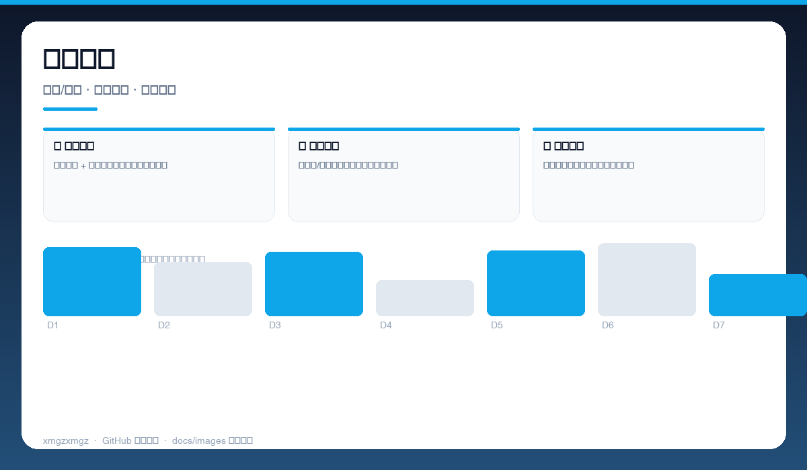
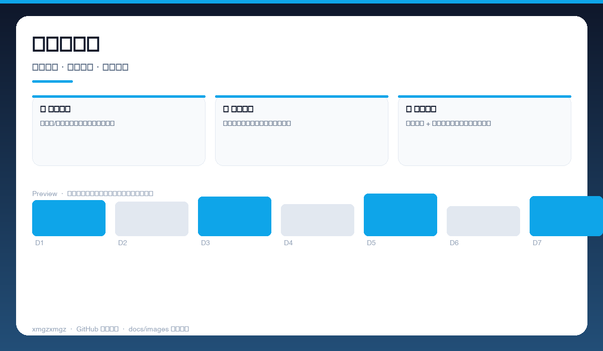
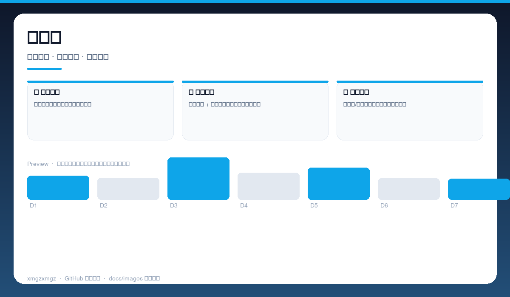

# 📚 ruankao-cli — ruankao-cli

> 终端里的高项题库 — 离线刷题、随机组卷、错题本，上班也能偷偷学。

[](https://github.com/xmgzxmgz/ruankao-cli)
[](https://github.com/xmgzxmgz/ruankao-cli/releases)
[](LICENSE)
[](https://github.com/xmgzxmgz/ruankao-cli/actions/workflows/release.yml)

---

## ✨ 功能一览

| 模块 | 能力 | 状态 |
|------|------|------|
| 📖 离线题库 | 历年真题 + 模拟题离线可用，无网也能刷 | ✅ |
| 🎲 随机组卷 | 按章节/难度智能组卷，模拟真实考试 | ✅ |
| 📝 错题回顾 | 自动收录错题，间隔复习直至掌握 | ✅ |

---

## 📸 功能预览

> 以下为自动生成的示意预览（无需本地部署截图），展示核心功能形态。

| 总览 | 细节 | 流程 |
|------|------|------|
|  |  |  |
| 终端刷题 · 单选/多选 · 即时判题 · 解析展示 | 组卷与模考 · 随机组卷 · 计时模考 · 得分报告 | 错题本 · 错题归集 · 标签筛选 · 复习进度 |

<details>
<summary>查看大图</summary>


</details>

---

## 🚀 快速开始

```bash
pip install ruankao-cli
ruankao practice --random 20
ruankao review --wrong-only
ruankao mock --year 2024
```

---

## 🛠 技术栈

Python · Click · Rich Terminal UI · YAML 题库 · 本地存储

---

## 🗂️ 目录结构（节选）

```
ruankao-cli/
├── docs/images/        # 本 README 的三张自动生成预览图
├── .github/workflows/  # Auto Release 自动发版
├── README.md
└── ...                 # 源码与配置
```

---

## 📦 Releases

本仓库已启用 **Auto Release**（`.github/workflows/release.yml`）：

- 推送 `v*` tag 自动发版：`git tag v0.2.0 && git push origin v0.2.0`
- 手动触发：`gh workflow run "Auto Release" -f version=v0.2.0`（留空则自动 patch +1）
- 变更说明自动生成（`--generate-notes`）

前往 [Releases](https://github.com/xmgzxmgz/ruankao-cli/releases) 查看。

---

## 🙏 相关项目

- [workbuddy-account-hub](https://github.com/xmgzxmgz/workbuddy-account-hub) — WorkBuddy 账户中枢（本 README 的样板）
- 更多见 [xmgzxmgz 主页](https://github.com/xmgzxmgz)

---

## 许可

MIT
